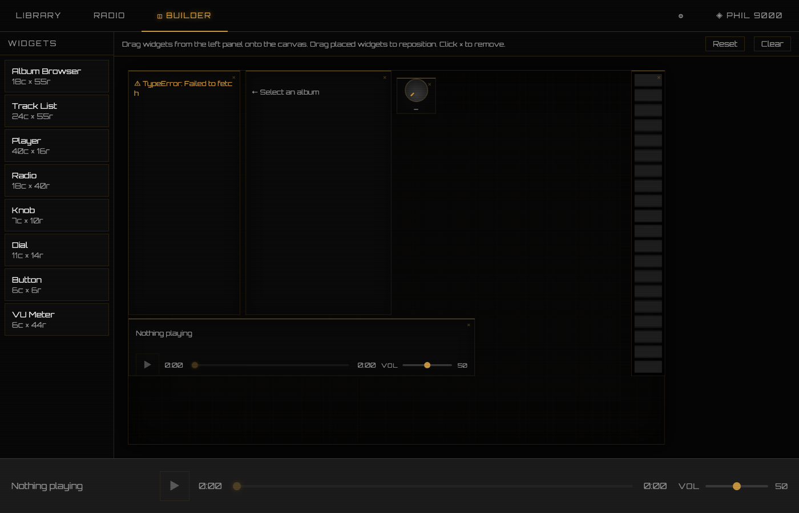

# musicphiles

**Your music. Your way.**

A distraction-free listening console for Navidrome. Drag live widgets onto a canvas and build the interface you actually want — no ads, no algorithm, no noise.


<!-- Replace with an actual screenshot before submitting to the apps directory -->

---

## Status

Early release. Core playback works end-to-end. The widget builder is live.

---

## What it does

musicphiles is a web frontend that connects directly to your Navidrome server. You get a drag-and-drop canvas where you place live widgets — album browser, track list, player controls, VU meter — and arrange them however you want.

The flagship theme, **PHIL 9000**, ships with a pre-built retro console layout. It loads ready to use.

No backend. No account. No tracking. Your credentials stay in your browser.

---

## Requirements

- [Navidrome](https://www.navidrome.org/) 0.49+ (Subsonic API)
- A modern browser (Chrome, Firefox, Safari)
- Node.js 18+ to run locally

---

## Setup

```bash
git clone https://github.com/your-username/musicphiles
cd musicphiles
npm install
npm run dev
```

Open [http://localhost:5173](http://localhost:5173). On first launch you'll see a setup screen — enter your Navidrome URL, username, and password. Hit **Test connection**, then **Save**. Your library loads immediately.

Credentials are written to `localStorage` only. Nothing is transmitted anywhere except directly to your Navidrome server.

---

## Themes

| Theme | Description |
|---|---|
| **PHIL 9000** | Retro AI console. Pre-built layout, amber on black. |
| **Terminal** | Green-on-black terminal aesthetic. |
| **Boombox** | Casual and warm. Dual VU meters. |

Switch themes from the top bar. Each theme has its own saved layout.

---

## Widget builder

The canvas is 96 columns wide, with an 8px row height — sized for iPad Pro 11" landscape. Drag widgets from the palette on the left onto the canvas. Drag placed widgets to reposition. Hit **Reset** to restore the theme's default layout.

Available widgets: Album Browser, Track List, Player, VU Meter, Knob, Dial, Button, Radio.

---

## Contributing

This is a personal project at an early stage. Bug reports and ideas welcome via GitHub Issues.

---

## License

MIT
